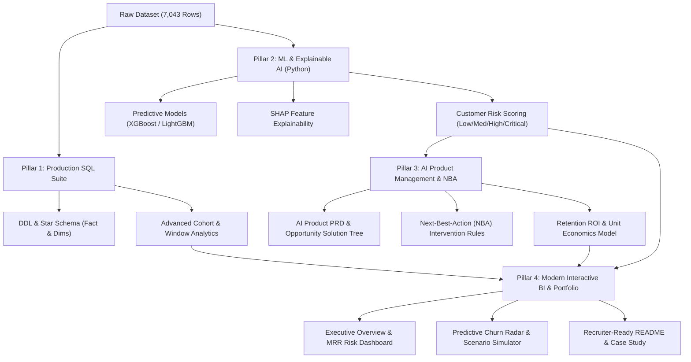

# 📊 Telecom Customer Churn & Retention Analytics
## Comprehensive Project Audit, Architecture Review & Rebuild Strategy

> **Target Positioning:** Senior Data Analyst / AI Product Manager (Customer Growth & Retention)  
> **Repository:** `TELCO-CHURN-ANALYSIS`  
> **Status:** Project Audit & Strategic Plan Complete

---

## Executive Summary

This document presents a comprehensive technical audit of the existing **Telco Churn Analysis** repository and a production-grade blueprint for rebuilding it into a premier **Customer Churn & Retention Analytics + AI Next-Best-Action (NBA) Platform**.

While the current repository possesses a high-quality foundational dataset (7,043 customer records with operational support ticket attributes), its analytical and engineering implementation is rudimentary (empty SQL scripts, basic retrospective Tableau Specification visuals, and zero predictive modeling or AI product strategy).

This document outlines the detailed findings from every file and presents a 4-pillar rebuild plan designed for Data Analyst and AI Product Manager hiring evaluation.

---

## 1. Complete File Inventory & Purpose

| File Name | File Type | Size | Current Purpose & Contents |
| :--- | :--- | :--- | :--- |
| [`RAW DATA.xlsx`](file:///d:/Projects/customer-churn/TELCO-CHURN-ANALYSIS/RAW%20DATA.xlsx) | Excel Spreadsheet | 792 KB | Primary source dataset containing **7,043 customer records** across **23 features** (demographics, services, billing, support tickets, churn). |
| [`SQLQuery1.sql`](file:///d:/Projects/customer-churn/TELCO-CHURN-ANALYSIS/SQLQuery1.sql) | SQL Script | 25 B | A single-line script (`CREATE DATABASE TEL_CHURN`) meant to initialize the database in MS SQL Server. |
| [`SQLQuery2.sql`](file:///d:/Projects/customer-churn/TELCO-CHURN-ANALYSIS/SQLQuery2.sql) | SQL Script | 177 B | Minimal 8-line script containing basic `SELECT *`, a `NULL` count check on `TotalCharges`, and an `UPDATE` setting `TotalCharges = 0`. |
| [`DASHBOARDS.pbix`](file:///d:/Projects/customer-churn/TELCO-CHURN-ANALYSIS/DASHBOARDS.pbix) | Tableau Specification File | 892 KB | Tableau Specification desktop report containing data transformation steps, basic DAX calculations, and 2 report pages: **`ALL CUSTOMER`** and **`CHURNED CUSTOMER`**. |
| [`REPORT.docx`](file:///d:/Projects/customer-churn/TELCO-CHURN-ANALYSIS/REPORT.docx) | Word Document | 22 KB | Written analytical report detailing project background, methodology, KPI summaries, observations, and business recommendations. |
| [`README.md`](file:///d:/Projects/customer-churn/TELCO-CHURN-ANALYSIS/README.md) | Markdown | 5.2 KB | Repository documentation summarizing goals, dataset schema, tool methodology, key KPI stats, observations, and dashboard links. |
| [`CUSTOMER DASHBOARD.png`](file:///d:/Projects/customer-churn/TELCO-CHURN-ANALYSIS/CUSTOMER%20DASHBOARD.png) | Image | 59.6 KB | Preview screenshot of the first Tableau Specification dashboard tab ("ALL CUSTOMER"). |
| [`CHURNED CUSTOMER.png`](file:///d:/Projects/customer-churn/TELCO-CHURN-ANALYSIS/CHURNED%20CUSTOMER.png) | Image | 31.1 KB | Preview screenshot of the second Tableau Specification dashboard tab ("CHURNED CUSTOMER"). |
| [`REPORT CONTENT.png`](file:///d:/Projects/customer-churn/TELCO-CHURN-ANALYSIS/REPORT%20CONTENT.png) | Image | 8.3 KB | Graphic thumbnail/preview asset of report structure. |
| [`.gitattributes`](file:///d:/Projects/customer-churn/TELCO-CHURN-ANALYSIS/.gitattributes) | Git Config | 68 B | Git configuration file handling line endings and LFS attributes. |

---

## 2. In-Depth Analysis of Existing Assets

### 2.1 Analysis of `README.md`
- **Strengths:** Clear narrative arc, well-organized sections (Introduction, Methodology, KPIs, Observations, Recommendations).
- **Critical Weaknesses:**
  - **External Hardcoded URLs:** All links point to the previous author's GitHub repository (`https://github.com/ANUPRIYAROYANU/...`), creating broken experiences in clones or forks.
  - **Missing Code Artifacts:** Claims SQL Server data transformations, BIT-to-VARCHAR conversions, and staging workflows, but notes *"Not all queries are uploaded"*.
  - **Data Discrepancy:** Cites 1,868 churned customers when the actual dataset has **1,869** ($26.54\%$ churn rate).
  - **Lack of Modern Business/Growth Metrics:** Only presents volume metrics (Total Customers, Total Revenue, Avg Monthly Charges). It lacks **MRR Churn, CLV (Customer Lifetime Value), CAC Payback, Net Revenue Retention (NRR), and Cohort Churn Hazard Rates**.
  - **No AI / ML / Product Framing:** Missing predictive machine learning, SHAP explainability, retention ROI calculators, and AI Product Management PRD artifacts.

### 2.2 Analysis of SQL Files (`SQLQuery1.sql` & `SQLQuery2.sql`)
- **Current Contents:**
  ```sql
  -- SQLQuery1.sql
  CREATE DATABASE TEL_CHURN

  -- SQLQuery2.sql
  SELECT *  FROM [RAW DATA EXCEL]
  SELECT COUNT(*) FROM [RAW DATA EXCEL] WHERE TotalCharges IS NULL
  UPDATE [RAW DATA EXCEL] SET TOTALCHARGES =0  WHERE TotalCharges IS NULL
  ```
- **Major Technical Flaws:**
  1. **Whitespace Bug:** In `RAW DATA.xlsx`, the 11 records with missing `TotalCharges` contain blank spaces (`' '`), not SQL `NULL`. In SQL Server / PostgreSQL, `WHERE TotalCharges IS NULL` evaluates to `0` records matched, failing to clean the dataset.
  2. **No Data Modeling / DDL:** No table definitions with primary keys, foreign keys, constraints, or indexing.
  3. **No Dimensional Architecture:** Lacks staging layers, Fact tables, and Dimension tables (`dim_customers`, `dim_services`, `fct_subscriptions`, `fct_support_tickets`).
  4. **No Advanced Analytics:** Completely missing window functions, cohort retention queries, tenure deciles, churn rate by service combinations, and revenue risk matrices.

### 2.3 Inspection of `RAW DATA.xlsx` Dataset
- **Dimensions:** 7,043 rows $\times$ 23 columns.
- **Target Distribution:**
  - `Churn = No`: 5,174 ($73.46\%$)
  - `Churn = Yes`: 1,869 ($26.54\%$)
- **Data Domains:**
  1. **Demographics:** `customerID`, `gender`, `SeniorCitizen` (0/1), `Partner`, `Dependents`.
  2. **Tenure & Subscriptions:** `tenure` (0 to 72 months), `PhoneService`, `MultipleLines`, `InternetService` (DSL, Fiber optic, No), `OnlineSecurity`, `OnlineBackup`, `DeviceProtection`, `TechSupport`, `StreamingTV`, `StreamingMovies`.
  3. **Contract & Financials:** `Contract` (Month-to-month, One year, Two year), `PaperlessBilling`, `PaymentMethod` (Electronic check, Mailed check, Bank transfer, Credit card), `MonthlyCharges` (\$18.25 - \$118.75), `TotalCharges` (\$18.80 - \$8684.80).
  4. **Support Ticket Operations (High Signal!):**
     - `numAdminTickets`: 0 to 5 tickets (Average: 0.52)
     - `numTechTickets`: 0 to 9 tickets (Average: 0.42)
- **Data Quality Nuances:**
  - 11 new customers with `tenure = 0` have blank string values `' '` in `TotalCharges`.
  - Inconsistent type encoding (`SeniorCitizen` as integer 0/1 vs. other boolean flags as `"Yes"`/`"No"`).
  - Redundant values (`"No internet service"`, `"No phone service"`) across sub-service columns.

### 2.4 Tableau Specification Dashboard (`DASHBOARDS.pbix`)
- **Structure:** 2 report tabs:
  1. **`ALL CUSTOMER`:** High-level summary cards (Total Customers, Churn Rate, Total Revenue, Avg Monthly Charges), bar/area charts for Internet Service, Contract, Payment Method, Monthly Charges, and Tenure. Pivot table for service subscriptions.
  2. **`CHURNED CUSTOMER`:** Focuses on the 1,869 churned users, breaking down add-on service adoption (Online Backup, Security, Tech Support) and visual distributions across contracts and payments.
- **Shortcomings:**
  - **Purely Retrospective:** Tells what happened in the past; provides no forward-looking churn probability tiers or high-risk cohort alerts.
  - **No Dynamic Financial Modeling:** No "What-If" parameter controls (e.g., simulating the revenue impact of reducing month-to-month churn by 10%).
  - **Fragmented Visuals:** Many isolated single-metric cards and low-density charts rather than a modern, cohesive C-Suite dashboard layout.

---

## 3. Project Audit Matrix

```
┌────────────────────────────────────────┬────────────────────────────────────────┬────────────────────────────────────────┐
│            KEEP & LEVERAGE             │           CURRENT DEFICIENCIES         │            WHAT TO REBUILD             │
├────────────────────────────────────────┼────────────────────────────────────────┼────────────────────────────────────────┤
│ • 7,043-row enriched dataset           │ • SQL layer is practically empty       │ • Enterprise SQL Analytics Suite       │
│ • Support ticket operational features  │ • No Python / ML predictive modeling   │ • ML Churn Engine (XGBoost + SHAP)     │
│ • Clear business domain & problem      │ • Retrospective-only Tableau Specification visual   │ • AI Next-Best-Action (NBA) System     │
│ • Key churn drivers identified         │ • Broken links and generic README      │ • Interactive Executive & Risk BI App  │
│ • Real-world telecom service context   │ • No Product / AI PM business framing  │ • AI PM Artifacts (PRD, ROI Calculator)│
└────────────────────────────────────────┴────────────────────────────────────────┴────────────────────────────────────────┘
```

---

## 4. End-to-End Rebuild Blueprint (Data Analyst + AI PM)

To transform this repository into an elite portfolio project for **Data Analyst** and **AI Product Manager** roles, here is the structured 4-pillar improvement plan:



---

### Pillar 1: Enterprise SQL Data Pipeline & Analytical Modeling
1. **Schema & DDL Scripts:**
   - `01_schema_setup.sql`: Table creation with strict data types, foreign keys, and constraints.
   - `02_data_cleaning_and_staging.sql`: Robust handling of whitespace blanks (`NULLIF(TRIM(TotalCharges), '')`), data type casting, and standardizing boolean flags.
   - `03_star_schema_views.sql`: Dimensional model (`dim_customers`, `dim_services`, `dim_contracts`, `fct_subscriptions`, `fct_support_tickets`).
2. **Advanced Analytics Queries (`04_advanced_churn_analytics.sql`):**
   - **Tenure Cohort Survival Analysis:** Churn rates by tenure vintage and contract commitment.
   - **Support Ticket Escalation Velocity:** Churn probability inflection points based on technical vs. administrative tickets.
   - **Revenue at Risk:** Month-to-month vs. Annual contract MRR exposure.
   - **Service Synergy Matrix:** Identifying multi-product adoption combinations that maximize customer stickiness.

---

### Pillar 2: Machine Learning & Explainable AI (Python)
1. **End-to-End Python Pipeline (`churn_ml_pipeline.py` / Jupyter Notebook):**
   - **Data Preprocessing & Encoding:** Automated one-hot encoding, numeric scaling, and zero-tenure imputation.
   - **Model Benchmarking:** Comparison of Logistic Regression, Random Forest, XGBoost, and LightGBM with hyperparameter tuning.
   - **Class Imbalance Optimization:** Precision-Recall AUC tuning, Cost-Sensitive Learning, and threshold optimization.
2. **Explainable AI (XAI) with SHAP:**
   - Global feature importance (identifying top macro churn drivers like Fiber Optic quality and Month-to-month contracts).
   - Local SHAP waterfall plots (explaining why an individual customer is flagged as high risk).
3. **Scored Output Dataset:**
   - Appends `churn_probability`, `risk_tier` (Low, Medium, High, Critical), and `primary_churn_driver` to each customer record.

---

### Pillar 3: AI Product Management & Next-Best-Action (NBA) Strategy
1. **Product Requirements Document (`PRD_AI_CHURN_PREVENTION_ENGINE.md`):**
   - **Problem Statement & Business Goals:** Mitigate $X in annual churn revenue loss.
   - **Target Personas:** Customer Success Managers, Retention Marketing Leads, Call Center Agents.
   - **System Architecture & Data Flows:** Real-time scoring vs. batch inference.
   - **Success Metrics:** NRR increase, 90-day retention lift, Campaign ROI, False Positive intervention cost.
2. **Next-Best-Action (NBA) Retention Playbooks:**
   - **Trigger 1 (Tech Ticket Escalation + Fiber):** Automatically dispatch senior VIP technical assistance and issue a \$10 service credit.
   - **Trigger 2 (Electronic Check + Month-to-Month):** In-app prompt offering 15% discount for switching to Credit Card / Auto-Pay with a 1-year contract.
   - **Trigger 3 (Low Security/Backup Adoption):** 60-day free trial of Online Security & Tech Support bundle.
3. **Unit Economics & Retention ROI Simulator:**
   - Interactive financial model calculating:
     $$\text{Net ROI} = (\text{Retained Customers} \times \text{LTV}) - \text{Intervention Costs} - \text{Model Ops Cost}$$

---

### Pillar 4: Modern Business Intelligence & Portfolio Presentation
1. **Comprehensive Dashboard Suite:**
   - **Tab 1: Executive C-Suite Overview:** MRR Churn, Net Revenue Retention (NRR), Total Revenue at Risk, Churn Rate trends.
   - **Tab 2: Service & Operational Friction:** Tech/Admin ticket correlation, Fiber Optic performance bottleneck breakdown.
   - **Tab 3: AI Risk Radar & Predictive Cohorts:** Distribution of customer risk tiers, top at-risk accounts, SHAP driver summaries.
   - **Tab 4: What-If Scenario Sandbox:** Dynamic sliders to simulate retention intervention efficacy and ROI.
2. **Portfolio README & Case Study:**
   - Clean, professional GitHub presentation with architecture diagrams, interactive demo links, business impact metrics, and resume-ready talking points.

---

## 5. Next Steps

This complete plan is now documented in your project repository. When you are ready to proceed with execution, we can begin building each pillar step-by-step!
